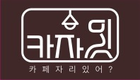
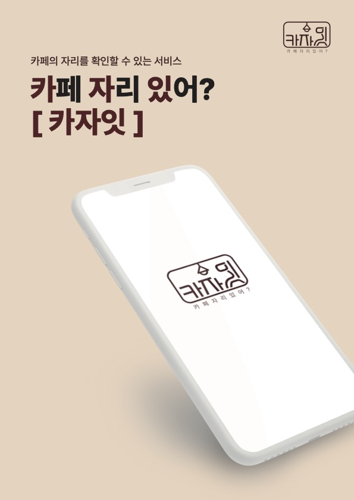
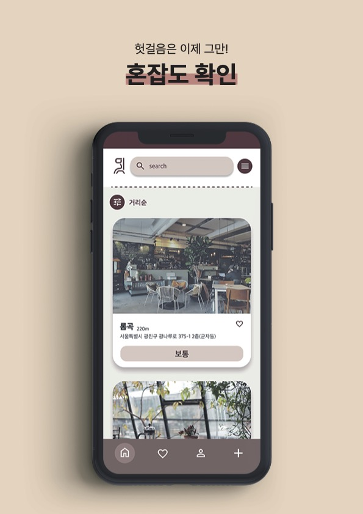
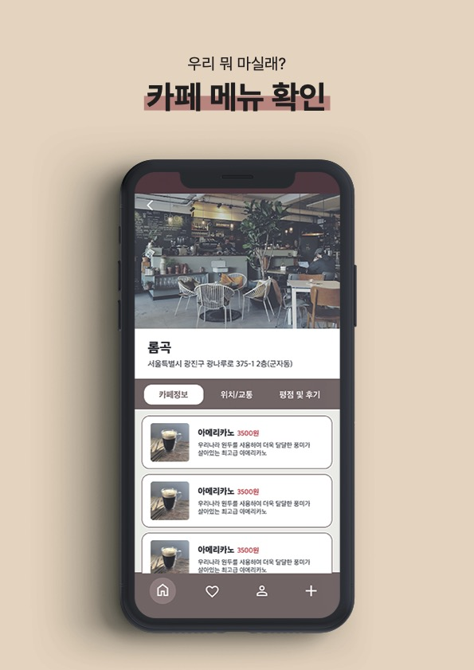
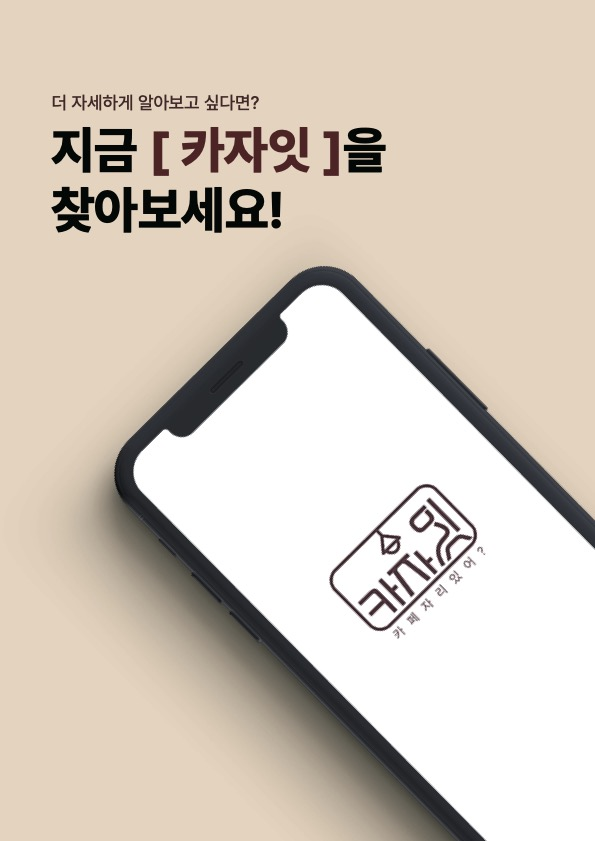

CaZaIt 프로젝트 🚀
===========

소개 💡
--

CaZaIt 프로젝트는 카페에서 발생하는 불편함을 해소하기 위해 개발되었습니다. 매일 카페에서 일하는 분들을 위한 솔루션으로, 카페에서 일하는 직원과 방문객 모두를 만족시키기 위해 개발되었습니다.

*   카페를 갔다가 자리가 없어서 허탕치신 분들 🙁
*   카공을 위한 카페를 찾는 분들 🏃‍♂️
*   친구들과 편하게 티타임을 갖고싶은 분들 👥
*   앉는 자리에 콘센트가 없어 곤란한 경우 ⚡️

이를 위해 카페 자리 혼잡도 알림, 콘센트 위치 알림, 카페 분위기 알림 서비스를 제공합니다.

기능 🛠️
--

*   **카페 자리 혼잡도 정보 제공** 🕒 : 방문객분들은 자리 혼잡도 정보를 실시간으로 확인할 수 있어요! 그리고, 직원분들은 자리 수용 인원을 예측하여 적절한 대처가 가능합니다.
*   **좌석 별 콘센트 위치 정보 제공** 🔌: 전기 제품을 사용하는 분들은 콘센트 위치 정보를 제공받아 적절한 자리를 선택할 수 있습니다 🎉
*   **카페 분위기 정보 제공** 🎨 : 방문객분들은 사진과 리뷰를 통해 카페 분위기를 파악할 수 있어요. 그리고 카페 내부의 특징을 파악할 수 있어 더욱 자세한 정보를 제공합니다 🌟
*   **카페 메뉴 정보 제공** 🍩 : 방문객분들은 카페의 대표 메뉴에 대한 정보를 확인할 수 있습니다! 그리고, 직원분들은 대표 메뉴에 대한 수요를 파악하여 적절한 대처가 가능합니다 🌟
*   **카페 리뷰 기능 제공** 📝 : 방문객분들은 카페를 이용한 후 리뷰를 작성할 수 있어요. 이를 통해 직원분들은 고객의 의견을 수집하여 카페 서비스 개선에 활용할 수 있습니다 🌟

활용 🙌
--
CaZaIt은 모든 종류의 카페에서 활용이 가능합니다. 
방문객들은 쉽게 CaZaIt을 다운로드하여 사용할 수 있으며, 카페 운영자들은 쉽게 CaZaIt에 카페 정보를 등록할 수 있습니다.

기술 스택 💻
--
CaZaIt은 다음과 같은 기술 스택으로 개발되었습니다.

* **Backend** : Spring Boot
* **Mobile** : Android, iOS
* **Deployment** : AWS(EC2)

사용 예시 📷
-----

